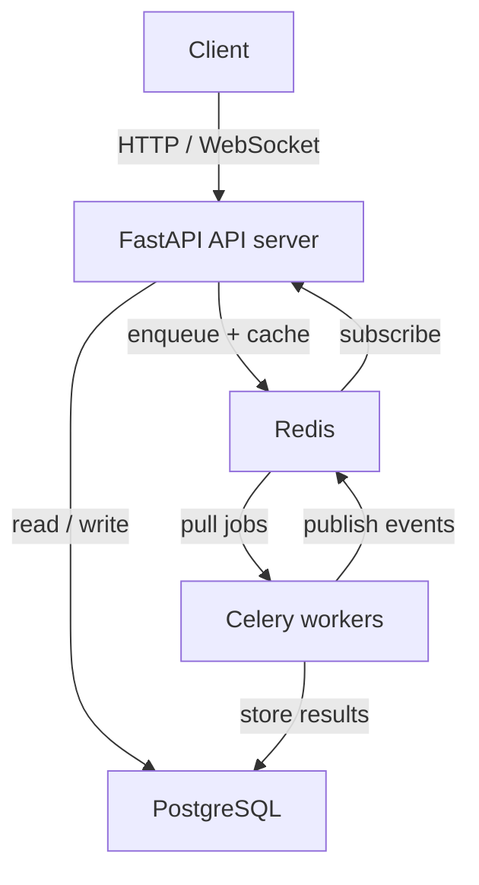

# Distributed Task Queue


A distributed task queue with real-time monitoring built with FastAPI, PostgreSQL, Redis, and Celery. Accepts tasks via REST API, processes them asynchronously with configurable retries and exponential backoff, and streams status updates over WebSockets.

Every architectural decision is documented with tradeoffs.

## Architecture



**FastAPI** validates input, persists task metadata, enqueues to Redis, and returns 202 within milliseconds. **PostgreSQL** is the source of truth with ACID guarantees. **Redis** serves as both Celery broker and a read-through cache with 10-second TTL. **Celery workers** pull tasks, execute with retry logic, and publish status events via Redis pub/sub. The API streams those events to clients over **WebSockets**.

### Design decisions

| Decision | Choice | Why |
|----------|--------|-----|
| Delivery | At-least-once | Tasks may run twice on worker crash, but never lost. Exactly-once requires distributed transactions. |
| Response model | Async (202 Accepted) | Client doesn't wait. API stays fast under load. |
| Broker | Redis | Simpler than RabbitMQ/Kafka at our scale. Would revisit at ~50K tasks/min. |
| Primary store | PostgreSQL | ACID transactions, complex queries, SQL filtering and pagination. |
| Cache strategy | Cache-aside + TTL | 10s TTL as safety net, explicit invalidation on writes. Fails open on Redis errors. |
| Rate limiting | Sliding window (sorted sets) | Per-IP per-endpoint quotas. More accurate than fixed window, no boundary spikes. |
| Real-time | WebSocket + pub/sub | Replaces polling. Per-task channels so subscribers get only relevant events. |
| Retries | Exponential backoff + jitter | Prevents thundering herd on transient failures. Capped at 10 minutes. |

## Performance

Load tested with 20 concurrent users over 2 minutes (single API
process, single Celery worker):

| Metric | Value |
|--------|-------|
| API median response time | 3 ms |
| API P95 response time | 6 ms |
| Single-task GET P95 | 7 ms |
| Rate limit rejection latency | 3 ms |
| Sustained throughput | ~15 req/s |
| Application error rate | 0% |

All 1,618 rejected requests were intentional 429 responses from the rate limiter (20 users sharing one IP exhaust the per-IP quota quickly). Excluding rate-limited requests, every request succeeded. Task execution uses a 2-second simulation sleep. With real sub-second task logic and multiple workers, throughput scales linearly with worker count.

See [loadtests/README.md](loadtests/README.md) for full percentile
breakdown and methodology.

## Features

- REST API with Pydantic validation, pagination, and filtering
- Async task processing with configurable priority and retry limits
- Exponential backoff with jitter on task failure
- Redis cache-aside with explicit invalidation
- Sliding window rate limiter (10 POST/min, 120 GET/min per IP)
- Real-time WebSocket streaming of task status changes
- Structured JSON logging via structlog
- Prometheus metrics at /metrics (submission count, completion count, duration histogram, in-flight gauge)
- Multi-stage Docker build with non-root runtime user
- GitHub Actions CI with Postgres and Redis service containers

## API

| Method | Path | Description |
|--------|------|-------------|
| POST | /api/v1/tasks | Submit a task (202) |
| GET | /api/v1/tasks/{id} | Status + result (200) |
| GET | /api/v1/tasks | List with filters (200) |
| DELETE | /api/v1/tasks/{id} | Cancel pending (200/409) |
| GET | /api/v1/health | Health check (200) |
| WS | /api/v1/tasks/ws/{id} | Real-time status stream |
| GET | /metrics | Prometheus metrics |

## Quick start

### Docker (recommended)

```bash
docker compose up --build
```

Starts PostgreSQL, Redis, the API, and a worker. Migrations run
automatically. API docs at http://localhost:8000/docs.

```bash
docker compose down       # stop
docker compose down -v    # stop and delete data
```

### Local development

```bash
docker compose up postgres redis -d
alembic upgrade head
uvicorn src.app.main:app --reload          # terminal 1
celery -A src.app.workers.celery_app worker --loglevel=info  # terminal 2
```

### Load testing

```bash
cd loadtests
locust -f locustfile.py --host=http://localhost:8000
```

Opens a dashboard at http://localhost:8089.

## Stack

| Layer | Tool |
|-------|------|
| Framework | FastAPI |
| Database | PostgreSQL 16 |
| Cache / Broker | Redis 7 |
| Task queue | Celery |
| Logging | structlog (JSON) |
| Metrics | Prometheus + starlette-prometheus |
| Containers | Docker + Docker Compose |
| CI | GitHub Actions |
| Testing | pytest, httpx, httpx-ws |
| Load testing | Locust |

## Project structure

```
src/app/
  api/            Route handlers (tasks, health, websockets)
  core/           Config, database, Redis client, metrics, logging
  models/         SQLAlchemy models
  schemas/        Pydantic request/response schemas
  services/       Cache, rate limiter, event publishing, event streaming
  workers/        Celery app and task handlers
tests/api/        Endpoint, caching, rate limit, metrics, WebSocket tests
loadtests/        Locust performance scenarios
```